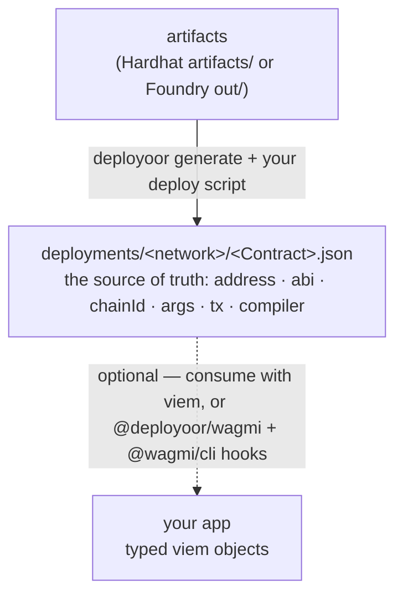

<div align="center">

# deployoor

**Deploy EVM contracts once. Use them everywhere as typed viem objects.**

Idempotent, typed deploys with a plain-JSON source of truth and a modular plugin model. The generated code depends only on `viem` — portable to any app, any chain, with zero lock-in. Works with Hardhat and Foundry.

</div>

---

## The problem

Deploying contracts to an EVM chain is solved. _Using_ them from your app is where it falls apart.

- **Addresses and ABIs get copy-pasted and go stale.** The address ends up in a deploy script, the ABI in some JSON file, and you paste both into your app by hand. Redeploy, and every copy silently drifts out of sync.
- **Provider/client wiring is manual boilerplate.** You re-thread the same client, address, and ABI into every contract, on every network.
- **There's no single source of truth** for what is deployed where — with which ABI, constructor args, tx hash, and compiler — across networks.
- **Deploy scripts aren't idempotent.** Re-running either redeploys or throws, when all you wanted was the contract you already deployed.
- **Tools couple your app to themselves.** You want generated code that depends only on `viem`, so you can drop the tool later with zero lock-in.

## The fix

deployoor makes a plain `deployments/` folder the single source of truth, and generates the wiring for you:

- Every deploy is recorded to `deployments/<network>/<Contract>.json` — address, ABI, chainId, args, tx, compiler. No copy-paste, no drift.
- Generated deployers inject the address and ABI for you. You add a client; nothing else.
- `getOrDeploy<Name>` is **idempotent and re-runnable**: first call deploys and records, later calls return the existing contract with no tx. `force: true` redeploys; `deploymentName` (default: the contract name) tracks multiple instances of one contract; `register(...)` records an external contract (e.g. USDC) and `reset(...)` forgets records — both with no tx.
- **Bring any signer, any RPC** — deployoor only ever sees a viem `WalletClient` + `PublicClient`, so a CI private key, an injected browser wallet, a Ledger, or a hosted wallet like Privy or Turnkey all work the same way. The library stays dependency-light; the signer and the RPC are whatever you hand it.
- **Zero lock-in** — the record (plain JSON) and the typed viem access depend on nothing but `viem`. Keep them in their own package, separate from your contracts, as the single source of truth for every network — and import them anywhere, even the browser. Delete deployoor and your app keeps working.

The name is the crypto-degen `-oor` agent-noun of "deploy" (like buidloor / hodloor) — literally "the thing that deploys."

## How it works

deployoor reads your compiled artifacts, deploys idempotently, and records each deploy to `deployments/<network>/<Contract>.json` — a plain-JSON source of truth for every address, ABI, chain, constructor args, tx, and compiler setting.



That `deployments/` folder is the product: universally-portable vanilla JSON, committed to your repo, readable by humans and any tool — in any language, since it's just JSON (a Python, Go, or Rust service reads it just as easily). Keep it in its own package, separate from your contracts, as the single source of truth for every network — and import it anywhere, even the browser. The generated deployers already hand back fully-typed viem objects at deploy time; consuming the records elsewhere — a frontend, a backend, a script — needs nothing but `viem`. Want typed React hooks? The optional [`@deployoor/wagmi`](packages/deployoor-wagmi) plugin feeds [`@wagmi/cli`](https://wagmi.sh/cli) — one convenient consumer, not a required second half.

## Quickstart

```bash
npx deployoor init && npx deployoor generate
```

```ts
// walletClient is any viem WalletClient — a local key, an injected wallet, or Privy/Turnkey.
// deploy once; every run after returns the same contract — no tx, just the recorded address.
const token = await getOrDeployToken({ walletClient, publicClient, args: [owner] });
await token.write.transfer([to, amount]);
```

Running it writes one record per contract — this is your committed source of truth:

```
deployments/
└─ sepolia/
   └─ Token.json
```

```jsonc
// deployments/sepolia/Token.json
{
  "contractName": "Token",
  "deploymentName": "Token", // defaults to contractName; set your own to track multiple instances
  "address": "0x5FbDB2315678afecb367f032d93F642f64180aa3",
  "chainId": 11155111,
  "networkName": "sepolia",
  "abi": [/* the full ABI, exactly as deployed */],
  "bytecode": "0x60806040...",
  "constructorArgs": ["0xf39Fd6e51aad88F6F4ce6aB8827279cffFb92266"],
  "transactionHash": "0x2c9a...d4e1",
  "deployer": "0xf39Fd6e51aad88F6F4ce6aB8827279cffFb92266",
  "deployedAt": 1719849600000,
  "compiler": {
    "version": "0.8.24+commit.e11b9ed9",
    "settings": { "optimizer": { "enabled": true, "runs": 200 } },
  },
  "kind": "standard",
}
```

Deploy more contracts, or to more networks, and you get `deployments/sepolia/Vault.json`, `deployments/base/Token.json`, and so on — one file per (network, contract). That folder is what your app (or `@deployoor/wagmi`) reads. `bigint` args are stored as strings, so the file is plain, greppable JSON.

`deployoor generate` reads your artifacts and emits one typed `getOrDeploy<Name>` per contract. Config lives in `deployoor.config.ts`. Plugins are deploy-lifecycle hooks authored against the `deployoor/plugin` SDK.

> **Using an AI agent?** [`skills/deployoor-integration`](skills/deployoor-integration/SKILL.md) is a SKILL an LLM can follow to wire deployoor into a project end-to-end.

## Testing

The generated deployers are just functions that take viem clients, so a test deploys exactly like production. [`@deployoor/testing`](packages/deployoor-testing)'s `createTestClients()` boots an in-memory EVM ([tevm](https://tevm.sh)) as viem clients **and an in-memory store** — no Hardhat test environment, no local node, and deploys never touch disk. Use any runner (vitest, `node:test`).

```ts
// token.test.ts — a smart-contract test in vitest. No Hardhat, no local node.
import { test, expect } from "vitest";
import { createTestClients } from "@deployoor/testing";
import { getOrDeployToken } from "../deployers";

test("transfer moves the balance", async () => {
  const clients = await createTestClients(); // a real EVM in-process + an in-memory store
  const [deployer, bob] = clients.accounts; // prefunded accounts

  // the SAME getOrDeploy you run in production — spread `clients` and it deploys to memory
  const token = await getOrDeployToken({ ...clients, args: [deployer.address] });

  await token.write.transfer([bob.address, 1000n]);
  expect(await token.read.balanceOf([bob.address])).toBe(1000n);
});
```

Same `getOrDeployToken` you ship — here it targets a throwaway in-process chain and an in-memory store, so each run is clean and nothing is written to `deployments/`. Multiple parties? `clients.walletClientFor(account)`. Want a real node instead? Build the clients against a local anvil or a fork; nothing else changes.

## Packages

| Package                                                | Description                                                                                                                                                                 |
| ------------------------------------------------------ | --------------------------------------------------------------------------------------------------------------------------------------------------------------------------- |
| [`deployoor`](packages/deployoor)                      | The deploy engine + codegen + CLI (`deployoor generate` / `deployoor init`). Reads Hardhat/Foundry artifacts, emits typed deployers, records each deploy to `deployments/`. |
| [`@deployoor/wagmi`](packages/deployoor-wagmi)         | A [`@wagmi/cli`](https://wagmi.sh/cli) plugin sourcing contracts from `deployments/` — typed contract objects for your app.                                                 |
| [`@deployoor/etherscan`](packages/deployoor-etherscan) | Verify on Etherscan V2 (one key, all chains; also Blockscout/Routescan).                                                                                                    |
| [`@deployoor/sourcify`](packages/deployoor-sourcify)   | Verify on Sourcify (v2, keyless).                                                                                                                                           |
| [`@deployoor/slack`](packages/deployoor-slack)         | Notify a Slack channel on each deploy.                                                                                                                                      |
| [`@deployoor/testing`](packages/deployoor-testing)     | `createTestClients()` — an in-memory EVM (tevm) as viem clients + an in-memory store, to test deploys with no local node.                                                   |

Plugins are deploy-lifecycle hooks; each ships as its own package and depends only on `deployoor/plugin`.

## Development

This is a pnpm + Turborepo monorepo.

```bash
pnpm install      # install everything
pnpm build        # build all packages (turbo)
pnpm test         # run all tests
pnpm typecheck    # typecheck all packages
pnpm lint         # oxlint
pnpm format       # prettier --write
```

Releases are managed with [Changesets](https://github.com/changesets/changesets): add one with `pnpm changeset`; merging the auto-opened "Version Packages" PR publishes to npm with provenance.

## Status

Early. The deploy core, the plugin model, and the wagmi bridge are stabilizing. Hardhat v2 is supported today; a Hardhat v3 port will follow if adoption warrants it.

## Roadmap

| Area   | What's coming                                                          | Status      |
| ------ | ---------------------------------------------------------------------- | ----------- |
| Compat | Hardhat v2 **and** v3 (Foundry already supported)                      | Planned     |
| Deploy | Detect bytecode changes and redeploy (opt-in)                          | Planned     |
| Deploy | Proxies & diamonds (upgradeable contracts)                             | Planned     |
| Deploy | Deterministic addresses (CREATE2 / CREATE3)                            | Exploring   |
| Stores | Pluggable `StoreAdapter` + in-memory store **shipped**; HTTP + browser | In progress |
| Verify | More explorers (Blockscout-native, OKLink, custom endpoints)           | Exploring   |
| DX     | `--watch`, `deployoor list` / `status`, import existing deployments    | Considering |
| AI     | Upgrade-safety diff, deployments MCP server (opt-in, separate package) | Considering |

Full detail and rationale in [TODO.md](TODO.md).

## License

[MIT](LICENSE) © Valerio Leo
