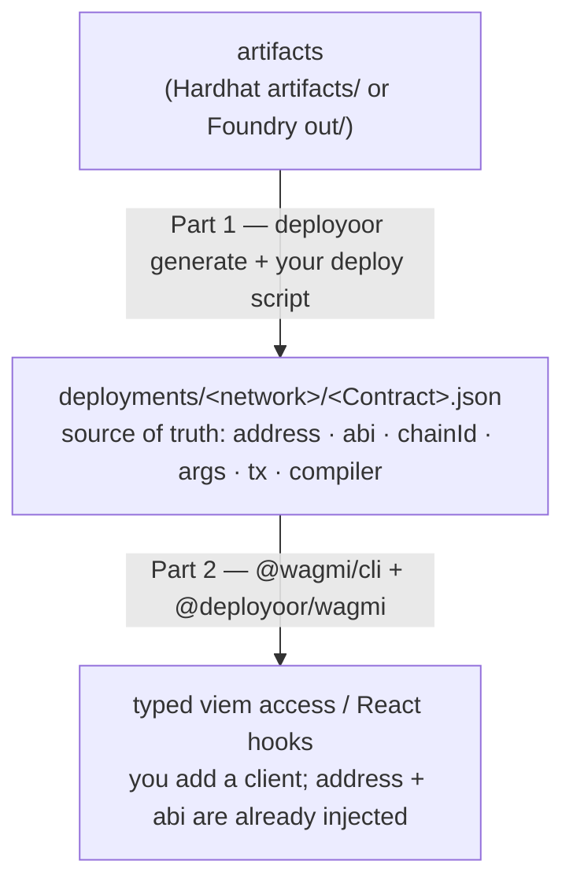

# deployoor

> A viem-first way to deploy smart contracts and use them as typed objects. Works with Hardhat and Foundry.

Run `npx deployoor generate`, write a deploy step, run it with `tsx scripts/deploy.ts`. You get a single source of truth for every address, ABI, and chain — and contracts you can import as fully-typed viem objects, with no copied addresses, no stale ABIs, and no provider wiring.

```ts
// deploy once; every run after that returns the same contract
const token = await getOrDeployToken({ walletClient, publicClient, args: [owner] });

// it's a viem contract object — read and write straight away
await token.write.transfer([to, amount]);
```

`deployoor` is a dev tool, like `@wagmi/cli` or Prisma: you run it, and the code it generates depends only on `viem` — never on `deployoor`.

## The problem

Deploying is the easy part. Living with what you deployed is the mess:

- You deploy a contract, then paste its address into a `.env`, a `constants.ts`, and the frontend. Three copies, guaranteed to drift.
- ABIs get hand-copied next to those addresses and go stale after the next change.
- Deploy scripts are bespoke and not idempotent: re-running either redeploys everything or throws halfway.
- Verification and notifications are separate manual steps you forget until someone asks "is this verified?"
- Addresses live in a different shape for every chain, with no single source of truth.
- Switching between Hardhat and Foundry means rewriting your deploy tooling.

`deployoor` makes the deployment itself the source of truth, and everything downstream reads from it.

## How it works

Two parts, with a plain `deployments/` folder as the contract between them:



`deployoor` owns Part 1 (deploy + the `deployments/` record). Part 2 reuses [`@wagmi/cli`](https://wagmi.sh/cli) — we don't reinvent codegen, we feed it.

## Install

```bash
pnpm add -D deployoor viem
```

One package. It detects whether you're in a Hardhat or Foundry project and reads the right artifacts.

## Quick start

**1. Generate** — scaffold a config, then generate:

```bash
npx deployoor init       # writes deployoor.config.ts
npx deployoor generate   # reads artifacts, writes ./deployers
```

`generate` auto-detects your project (`foundry.toml`/`out/` or `hardhat.config.*`/`artifacts/`), reads the artifacts, and writes a `deployers/` folder: one typed deployer per deployable contract, plus the typed artifacts. Everything it emits imports only `viem` and `deployoor`'s types.

Want to filter contracts, change folders, or add plugins? Edit `deployoor.config.ts`:

```ts
import { defineConfig } from "deployoor";
import { etherscan } from "@deployoor/etherscan";
import { slack } from "@deployoor/slack";

export default defineConfig({
  include: ["Token", "Vault"], // default: everything with bytecode
  out: "./deployers", // default
  deploymentsPath: "./deployments", // default
  plugins: [etherscan({ apiKey: process.env.ETHERSCAN_KEY }), slack({ webhook: process.env.SLACK_HOOK })],
});
```

**2. Deploy** — a plain script, run with `tsx`. The generated functions need only `viem`:

```ts
// scripts/deploy.ts
import { createWalletClient, createPublicClient, http } from "viem";
import { sepolia } from "viem/chains";
import { privateKeyToAccount } from "viem/accounts";
import { getOrDeployToken, getOrDeployVault } from "../deployers";

const account = privateKeyToAccount(process.env.PK as `0x${string}`);
const transport = http(process.env.RPC_URL);
const clients = {
  walletClient: createWalletClient({ account, chain: sepolia, transport }),
  publicClient: createPublicClient({ chain: sepolia, transport }),
};

const token = await getOrDeployToken({ ...clients, args: [account.address] }); // verifies/notifies via config plugins
const vault = await getOrDeployVault({ ...clients, args: [token.address] });
```

```bash
tsx scripts/deploy.ts
```

The bare minimum is just two viem clients — no plugins, no extra config.

**3. Use** — anywhere, as typed objects (Part 2, via the wagmi plugin — see below):

```ts
import { config } from "./wagmi";
import { readToken } from "./generated"; // generated by @wagmi/cli from deployments/

const balance = await readToken(config, { functionName: "balanceOf", args: [user] });
```

## Idempotent by design: `getOrDeploy`

`getOrDeploy` declares desired state — "this contract should exist on this network." The first call deploys and records it; every later call returns the existing contract with no transaction. It always hands back a viem contract, so callers never branch on "did it already exist."

```ts
const token = await getOrDeployToken({ walletClient, publicClient, args: [owner] }); // 1st run: deploys
const token = await getOrDeployToken({ walletClient, publicClient, args: [owner] }); // next runs: same contract, no tx

await getOrDeployToken({ walletClient, publicClient, args: [owner], force: true }); // redeploy on purpose
```

Already have a contract you didn't deploy (USDC, a partner contract)? Register it so it joins the address book:

```ts
import { register } from "deployoor";
register({ name: "USDC", address: "0x…", abi: usdcAbi, chainId: 8453 });
```

## Plugins: everything is a hook

There's no special "verifier" concept. A plugin is a small named object that subscribes to deploy-lifecycle hooks. A verifier, a Slack notification, and a gas report are the same kind of thing.

```ts
import { definePlugin } from "deployoor/plugin"; // the small, stable plugin SDK

export const slack = (o: { webhook: string }) =>
  definePlugin({
    name: "slack",
    onContractDeployed: async (ctx, { fetch }) => {
      await fetch(o.webhook, {
        method: "POST",
        body: JSON.stringify({
          text: `${ctx.deployment.contractName} → ${ctx.deployment.address} on ${ctx.deployment.networkName}`,
        }),
      });
    },
  });
```

Each plugin is its own package (it peer-depends on `deployoor` and imports only from `deployoor/plugin`), so you update one without touching the tool. By default a failing plugin warns and the deploy still records (you can't un-send the transaction); set `onPluginError: 'throw'` to surface it. Per-deploy overrides let a single contract opt out or pass plugin-specific options:

```ts
await getOrDeployVault({ ...clients, args: [token.address], plugins: { etherscan: false } }); // skip verifying this one
```

Maintained plugins: [`@deployoor/etherscan`](../deployoor-etherscan) (Etherscan V2 — also Blockscout/Routescan via `apiUrl`), [`@deployoor/sourcify`](../deployoor-sourcify), [`@deployoor/slack`](../deployoor-slack). More ideas: Tenderly verification, Discord notifications, gas and cost reports, address-book and `.env` writers, IPFS source pinning, Safe / multisig proposals.

## Hardhat and Foundry

The only framework-specific input is the artifacts directory, and `deployoor` detects it for you. In a Hardhat project it reads `artifacts/`; in a Foundry project it reads `out/` + `out/build-info`. Deploy and consumption are plain viem and identical either way.

## Using your contracts (Part 2)

`deployments/` is a stable, documented JSON format, so consuming it is just a [`@wagmi/cli`](https://wagmi.sh/cli) plugin — [`@deployoor/wagmi`](../deployoor-wagmi):

```ts
// wagmi.config.ts
import { defineConfig } from "@wagmi/cli";
import { actions } from "@wagmi/cli/plugins";
import { deployments } from "@deployoor/wagmi";

export default defineConfig({
  out: "src/generated.ts",
  plugins: [deployments({ path: "./deployments" }), actions()],
});
```

`wagmi generate` produces ABIs as `const`, per-chain address maps, and (with `actions()` or `react()`) framework bindings — all maintained by the wagmi team. We sit upstream and supply the source: the same contract deployed to several chains becomes one entry with an `address` map keyed by chainId.

## How it compares

- **hardhat-deploy / Hardhat Ignition** — great at deploying; they stop there. `deployoor` is viem-first, works with Foundry too, and carries the result into typed objects your app uses.
- **`@wagmi/cli`** — great at turning ABIs + addresses into typed access. But you give it those addresses. `deployoor` produces them as a byproduct of your own deploys (including local and testnet, which explorers never see), then feeds wagmi. They compose; this is not a wagmi replacement.

## Status

Early. The deploy core, the plugin model, and the wagmi bridge are stabilizing. Hardhat v2 is supported today; a Hardhat v3 port will follow if adoption warrants it.

## License

MIT
