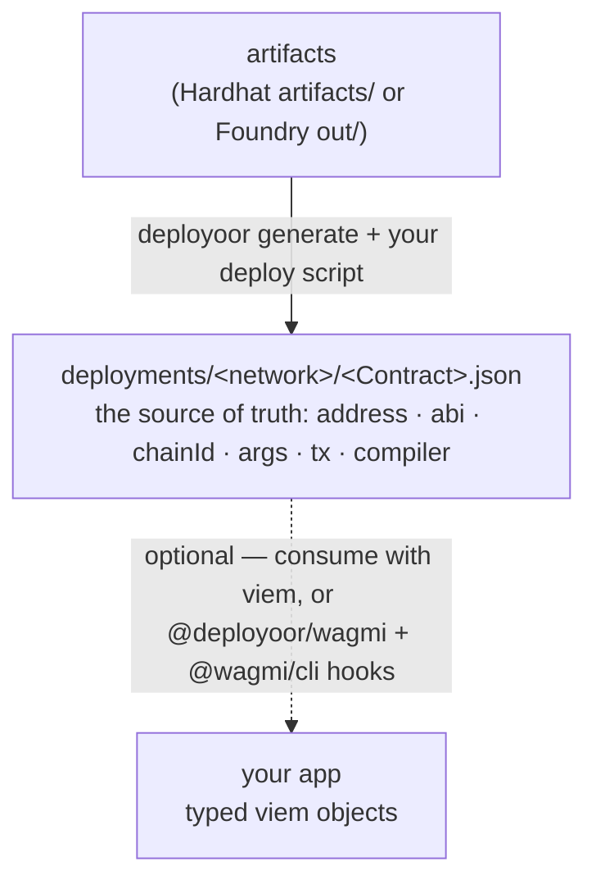

# deployoor

> A dead-simple, modular and extensible tool to deploy smart contracts and use them as fully-typed viem objects. Works out-of-the-box with Hardhat and Foundry.

Run `npx deployoor generate`, write a deploy script, run it like a standalone node file (eg `tsx scripts/deploy.ts`). You get a single source of truth for every address, ABI, and chain — and contracts you can import as fully-typed viem objects, with no copied addresses, no stale ABIs, and no provider wiring.

```ts
// deploy once; every run after that returns the same contract
const token = await getOrDeployToken({ walletClient, publicClient, args: [owner] });

// it's a viem contract object — read and write straight away
await token.write.transfer([to, amount]);
```

## The problem

Deploying is the easy part. Living with what you deployed is the mess:

- You deploy a contract, then paste its address into a `.env`, a `constants.ts`, and the frontend. Three copies, guaranteed to drift.
- ABIs get hand-copied next to those addresses and go stale after the next change.
- Deploy scripts are bespoke and not idempotent: re-running either redeploys everything or throws halfway.
- Verification and notifications are separate manual steps you forget until someone asks "is this verified?"
- Switching between Hardhat and Foundry means rewriting your deploy tooling.

`deployoor` makes the deployment itself the source of truth, and everything downstream reads from it.

## How it works

`deployoor` reads your compiled artifacts, deploys idempotently, and records each deploy to `deployments/<network>/<Contract>.json` — a plain-JSON source of truth for every address, ABI, chain, constructor args, tx, and compiler setting.



That `deployments/` folder is the product: portable vanilla JSON, committed to your repo, readable by humans and any tool. Consuming it is up to you and needs nothing but `viem`; if you want typed React hooks, the optional [`@deployoor/wagmi`](../deployoor-wagmi) plugin feeds [`@wagmi/cli`](https://wagmi.sh/cli) — one convenient consumer, not a required second half.

## Install

```bash
pnpm add -D deployoor viem
```

One package. It detects whether you're in a Hardhat or Foundry project and reads the right artifacts.

## Quick start

**1. Generate** — scaffold a config, then generate:

```bash
npx deployoor init       # writes deployoor.config.ts
npx deployoor generate   # reads artifacts, writes ./deployers
```

`generate` auto-detects your project (`foundry.toml`/`out/` or `hardhat.config.*`/`artifacts/`), reads the artifacts, and writes a `deployers/` folder: one typed deployer per deployable contract, plus the typed artifacts. Everything it emits imports only `viem` and `deployoor`'s types.

Want to filter contracts, change folders, or add plugins? Edit `deployoor.config.ts`:

```ts
import { defineConfig } from "deployoor";
import { etherscan } from "@deployoor/etherscan";
import { slack } from "@deployoor/slack";

export default defineConfig({
  include: ["Token", "Vault"], // default: everything with bytecode
  out: "./deployers", // default
  deploymentsPath: "./deployments", // default
  plugins: [etherscan({ apiKey: process.env.ETHERSCAN_KEY }), slack({ webhook: process.env.SLACK_HOOK })],
});
```

**2. Deploy** — a plain script, run with `tsx`. The generated functions need only `viem`:

```ts
// scripts/deploy.ts
import { createWalletClient, createPublicClient, http } from "viem";
import { sepolia } from "viem/chains";
import { privateKeyToAccount } from "viem/accounts";
import { getOrDeployToken, getOrDeployVault } from "../deployers"; // the folder deployoor generate wrote

const account = privateKeyToAccount(process.env.PK as `0x${string}`);
const transport = http(process.env.RPC_URL);
const clients = {
  walletClient: createWalletClient({ account, chain: sepolia, transport }),
  publicClient: createPublicClient({ chain: sepolia, transport }),
};

const token = await getOrDeployToken({ ...clients, args: [account.address] }); // verifies/notifies via config plugins
const vault = await getOrDeployVault({ ...clients, args: [token.address] });
```

```bash
tsx scripts/deploy.ts
```

The bare minimum is just two viem clients — no plugins, no extra config.

Each deploy is recorded to `deployments/<network>/<Contract>.json` — your committed source of truth:

```
deployments/
└─ sepolia/
   ├─ Token.json
   └─ Vault.json
```

```jsonc
// deployments/sepolia/Token.json
{
  "contractName": "Token",
  "deploymentName": "Token", // defaults to contractName; set your own to track multiple instances
  "address": "0x5FbDB2315678afecb367f032d93F642f64180aa3",
  "chainId": 11155111,
  "networkName": "sepolia",
  "abi": [/* the full ABI, exactly as deployed */],
  "bytecode": "0x60806040...",
  "constructorArgs": ["0xf39Fd6e51aad88F6F4ce6aB8827279cffFb92266"],
  "transactionHash": "0x2c9a...d4e1",
  "deployer": "0xf39Fd6e51aad88F6F4ce6aB8827279cffFb92266",
  "deployedAt": 1719849600000,
  "compiler": {
    "version": "0.8.24+commit.e11b9ed9",
    "settings": { "optimizer": { "enabled": true, "runs": 200 } },
  },
  "kind": "standard",
}
```

Plain, greppable JSON (`bigint` args are stored as strings), committed to your repo — this is exactly what step 3 reads. (A contract you `register` rather than deploy is recorded the same way, marked `"kind": "external"`.)

**3. Use** — anywhere, as typed objects (via the optional wagmi plugin — see below):

```ts
import { config } from "./wagmi";
import { readToken } from "./generated"; // generated by @wagmi/cli from deployments/

const balance = await readToken(config, { functionName: "balanceOf", args: [user] });
```

## Idempotent by design: `getOrDeploy`

`getOrDeploy` declares desired state — "this contract should exist on this network." The first call deploys and records it; every later call returns the existing contract with no transaction. It always hands back a viem contract, so callers never branch on "did it already exist."

```ts
const token = await getOrDeployToken({ walletClient, publicClient, args: [owner] }); // 1st run: deploys
const token = await getOrDeployToken({ walletClient, publicClient, args: [owner] }); // next runs: same contract, no tx

await getOrDeployToken({ walletClient, publicClient, args: [owner], force: true }); // redeploy on purpose
```

Deploying several instances of the same contract? Pass a `deploymentName` — it defaults to the contract name and is the key for both the record and idempotency:

```ts
const usdcVault = await getOrDeployVault({ ...clients, args: [usdc], deploymentName: "Vault_USDC" });
const daiVault = await getOrDeployVault({ ...clients, args: [dai], deploymentName: "Vault_DAI" });
```

Already have a contract you didn't deploy (USDC, a partner contract)? `register` it so it joins the address book — `generate` emits `register` and `reset` in `./deployers`:

```ts
import { register, reset } from "../deployers";

// register records an external contract (no tx). It won't overwrite a real deployment
// at the same name — reset that first, or use a different name.
const usdc = await register({ ...clients, name: "USDC", address: "0x…", abi: usdcAbi });

// reset only forgets local records, so it needs just a public client (no signer):
await reset({ publicClient, name: "Token" }); // one record; omit `name` to forget all — next getOrDeploy redeploys
```

## Testing

The generated deployers only need viem clients, so tests deploy exactly like production — against an in-memory EVM, no node. [`@deployoor/testing`](../deployoor-testing) gives you `createTestClients()` (tevm as viem clients + an in-memory store, so deploys never touch disk):

```ts
import { createTestClients } from "@deployoor/testing";
import { getOrDeployToken } from "../deployers";

const clients = await createTestClients();
const token = await getOrDeployToken({ ...clients, args: [owner] }); // deploys to memory
```

## Plugins: everything is a hook

There's no special "verifier" concept. A plugin is a small named object that subscribes to deploy-lifecycle hooks. A verifier, a Slack notification, and a gas report are the same kind of thing.

```ts
import { definePlugin } from "deployoor/plugin"; // the small, stable plugin SDK

export const slack = (o: { webhook: string }) =>
  definePlugin({
    name: "slack",
    onContractDeployed: async (ctx, { fetch }) => {
      await fetch(o.webhook, {
        method: "POST",
        body: JSON.stringify({
          text: `${ctx.deployment.contractName} → ${ctx.deployment.address} on ${ctx.deployment.networkName}`,
        }),
      });
    },
  });
```

Each plugin is its own package (it peer-depends on `deployoor` and imports only from `deployoor/plugin`), so you update one without touching the tool. By default a failing plugin warns and the deploy still records (you can't un-send the transaction); set `onPluginError: 'throw'` to surface it. Per-deploy overrides let a single contract opt out or pass plugin-specific options:

```ts
await getOrDeployVault({ ...clients, args: [token.address], plugins: { etherscan: false } }); // skip verifying this one
```

Maintained plugins: [`@deployoor/etherscan`](../deployoor-etherscan) (Etherscan V2 — also Blockscout/Routescan via `apiUrl`), [`@deployoor/sourcify`](../deployoor-sourcify), [`@deployoor/slack`](../deployoor-slack). More ideas: Tenderly verification, Discord notifications, gas and cost reports, address-book and `.env` writers, IPFS source pinning, Safe / multisig proposals.

## Hardhat and Foundry

The only framework-specific input is the artifacts directory, and `deployoor` detects it for you. In a Hardhat project it reads `artifacts/`; in a Foundry project it reads `out/` + `out/build-info`. Deploy and consumption are plain viem and identical either way.

## Testing

The generated deployers are plain functions that take viem clients, so a test deploys exactly like production. Point the clients at an in-memory EVM ([tevm](https://tevm.sh) — `pnpm add -D tevm`) and use whatever runner you like: vitest, `node:test`, anything. No Hardhat test environment, no local node, no separate deploy path to maintain.

```ts
// token.test.ts — a smart-contract test in vitest. No Hardhat, no local node.
import { test, expect } from "vitest";
import { createMemoryClient, PREFUNDED_ACCOUNTS } from "tevm";
import { createWalletClient, createPublicClient, custom } from "viem";
import { getOrDeployToken } from "../deployers";

test("transfer moves the balance", async () => {
  const memory = createMemoryClient({ miningConfig: { type: "auto" } }); // a real EVM, in process
  await memory.tevmReady();
  const [deployer, bob] = PREFUNDED_ACCOUNTS;
  const transport = custom(memory);
  const clients = {
    walletClient: createWalletClient({ account: deployer, chain: memory.chain, transport }),
    publicClient: createPublicClient({ chain: memory.chain, transport }),
  };

  // the SAME getOrDeploy you run in production — it only needs viem clients
  const token = await getOrDeployToken({ ...clients, args: [deployer.address], force: true });

  await token.write.transfer([bob.address, 1000n]);
  expect(await token.read.balanceOf([bob.address])).toBe(1000n);
});
```

`force: true` gives each run a clean deploy on the throwaway chain. Prefer a real node? Build the clients against a local anvil or a fork instead — the deploy call is identical.

## Using your contracts

The `deployments/` folder is plain, universally-portable JSON — ideal to commit as your project's single source of truth. Because JSON is universal, anything can consume it: another service, a script, or a backend in Python, Go, or Rust. And for the TypeScript/viem world, import it straight into the widely-used [`@wagmi/cli`](https://wagmi.sh/cli) via the [`@deployoor/wagmi`](../deployoor-wagmi) plugin — typed contract objects and React hooks, all ready to use everywhere you want:

```ts
// wagmi.config.ts
import { defineConfig } from "@wagmi/cli";
import { actions } from "@wagmi/cli/plugins";
import { deployments } from "@deployoor/wagmi";

export default defineConfig({
  out: "src/generated.ts",
  plugins: [deployments({ path: "./deployments" }), actions()],
});
```

`wagmi generate` produces ABIs as `const`, per-chain address maps, and (with `actions()` or `react()`) framework bindings — all maintained by the wagmi team. We sit upstream and supply the source: the same contract deployed to several chains becomes one entry with an `address` map keyed by chainId.

## How it compares

- **hardhat-deploy / Hardhat Ignition** — great at deploying; they stop there. `deployoor` is viem-first, works with Foundry too, and carries the result into typed objects your app uses.
- **`@wagmi/cli`** — great at turning ABIs + addresses into typed access. But you give it those addresses. `deployoor` produces them as a byproduct of your own deploys (including local and testnet, which explorers never see), then feeds wagmi. They compose; this is not a wagmi replacement.

## Status

Early. The deploy core, the plugin model, and the wagmi bridge are stabilizing. Hardhat v2 is supported today; a Hardhat v3 port will follow if adoption warrants it.

## License

MIT
